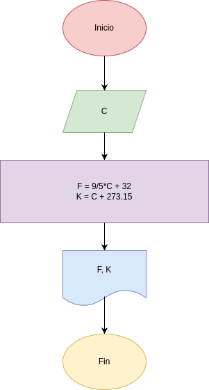

# Programa 4: conversor_de_temperatura
Programa en Python para convertir grados °C en grados °K, °F

## Análisis

### Variables de entrada
- C: grados celcius

### Procesamiento
- F: grados fahrenheit
- K: grados kelvin

$F = 9/5*C+32$

$K = C+273.15$

## Diseño

## Construcción
- codigo implementado en el archivo "conversor_de_temperatura.py"

